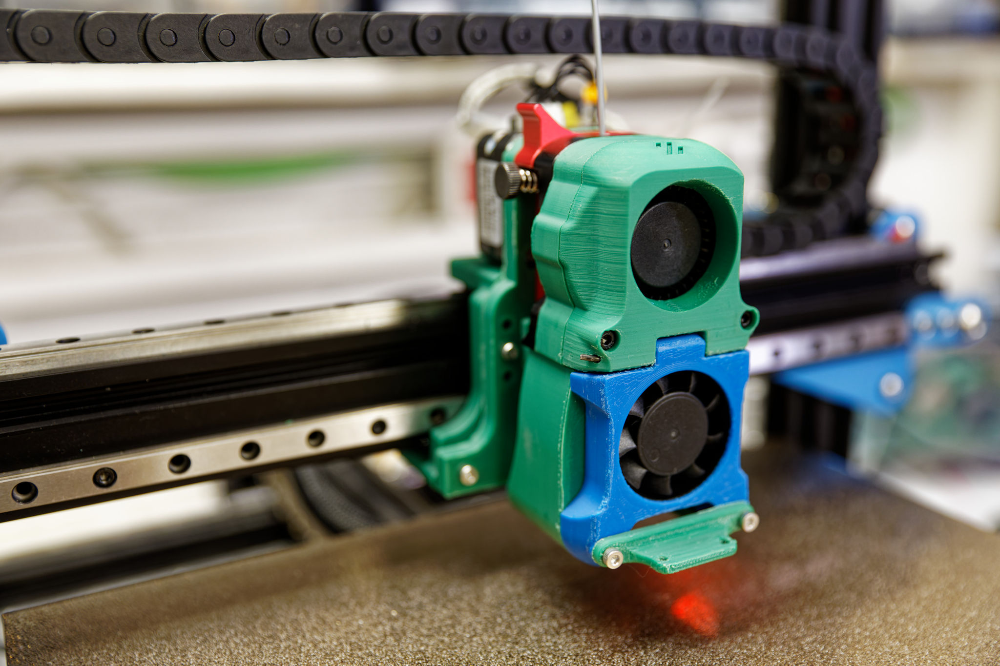

# SOVOL-SV01 Voron Afterburner an MGN9 Liniearführung
Hier habe ich einen Voron Afterburner an MGN9 Liniearführung, meines umgebauten SOVOL SV01 geschraubt. 

Als Hotend habe ich einen Phaetus Dragonfly benutzt. Die gedruckten Teile inklusive Fusen360 Dateien findet ihr ausch auf [Thingiverse](https://www.thingiverse.com/thing:4949372).
Eine zusätzliche Beschreibung des aufbaus zeige ich auf [YouTube](https://youtu.be/GP3lPlpb2eQ).
Meine Klipper Konfiguration findet ihr im Verzeichniss klipper_config.